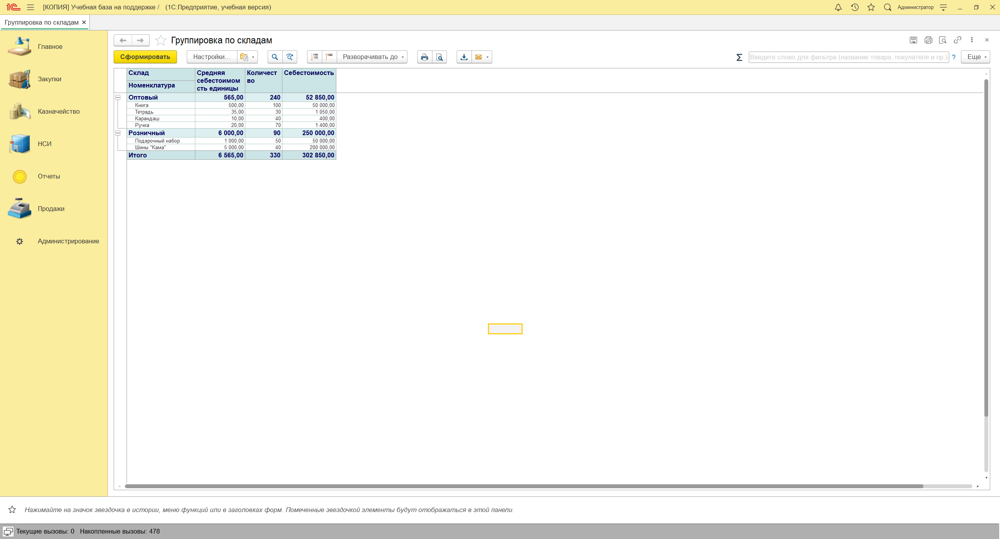
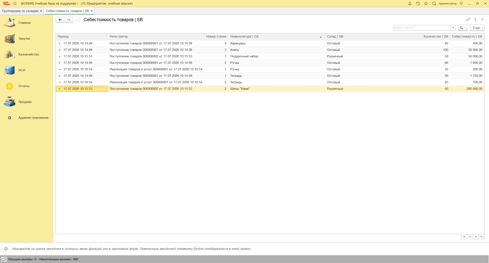
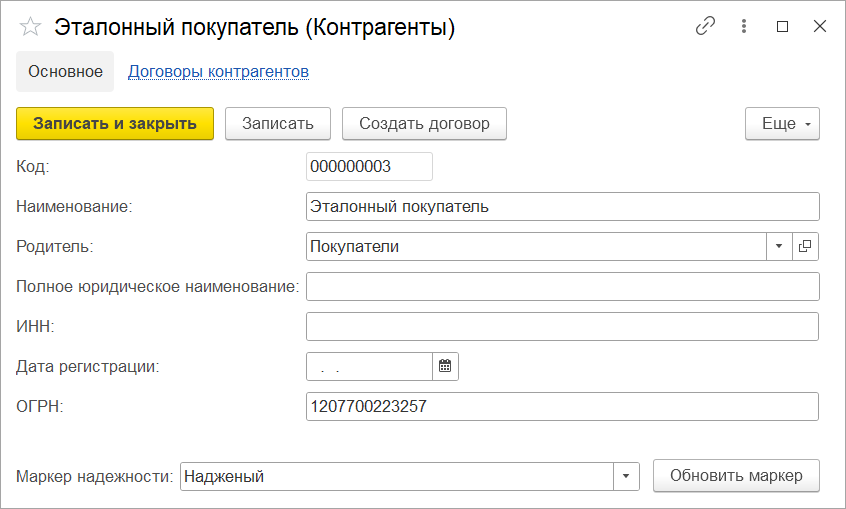
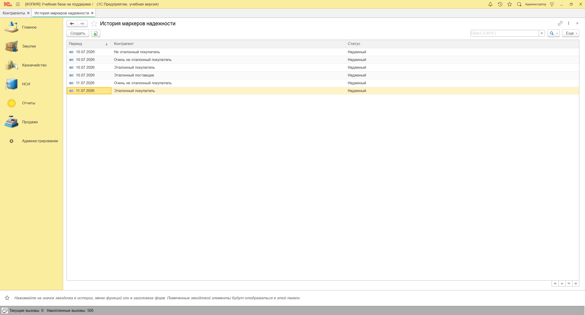
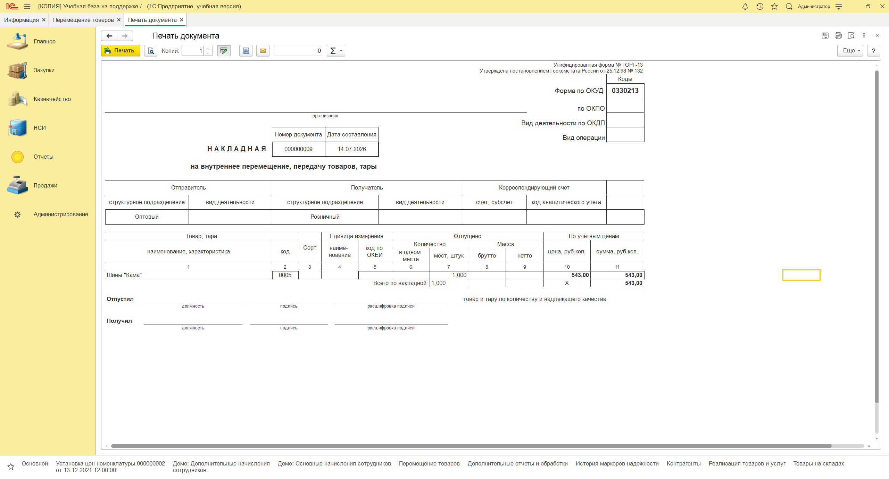

# Доработка конфигурации 1С для торговой компании

Учебный проект, разработанный в рамках курса «Профессия 1С-программист».

Проект выполнен на конфигурации, находящейся на поддержке. Доработки реализованы через расширение, внешний отчёт и внешнюю печатную форму без изменения основной конфигурации.

## Реализовано

- добавлен учёт себестоимости и контроль товарных остатков;
- разработан внешний отчёт на СКД для анализа остатков и себестоимости;
- реализована проверка контрагентов через API с обработкой JSON-ответа;
- создана внешняя печатная форма ТОРГ-13 для перемещения товаров;
- настроены обмен данными с филиалом и расчёт премии.

## Стек

1С:Предприятие 8.3, Конфигуратор, встроенный язык 1С, язык запросов, СКД, расширения конфигурации, HTTP, JSON, БСП, планы обмена и регистры расчёта.

## Файлы проекта

- [Расширение конфигурации](trade-company-enhancements.cfe)
- [Внешний отчёт «Анализ остатков и себестоимости»](stock-and-cost-analysis.erf)
- [Внешняя печатная форма ТОРГ-13](goods-transfer-torg-13.epf)

## Демонстрация

### Учёт себестоимости и контроль остатков

### Проверка контрагентов через API

### Внешняя печатная форма ТОРГ-13

## Примечание

Полная информационная база не публикуется, поскольку работа выполнена на предоставленной учебной конфигурации. В репозитории размещены только самостоятельно выполненные доработки и демонстрационные материалы.
